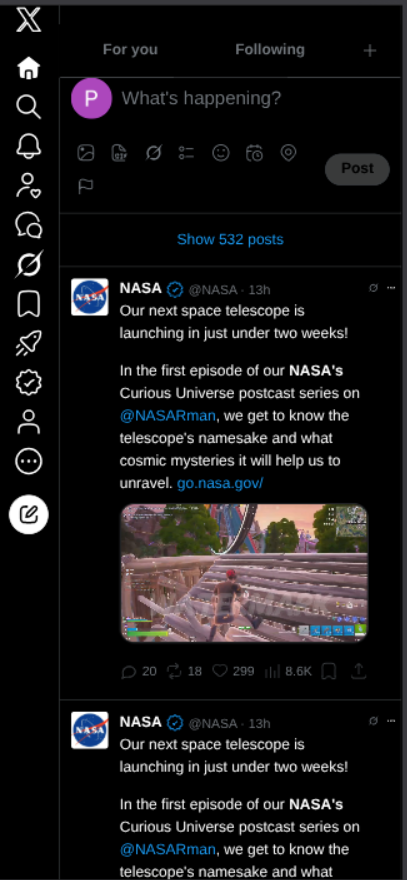
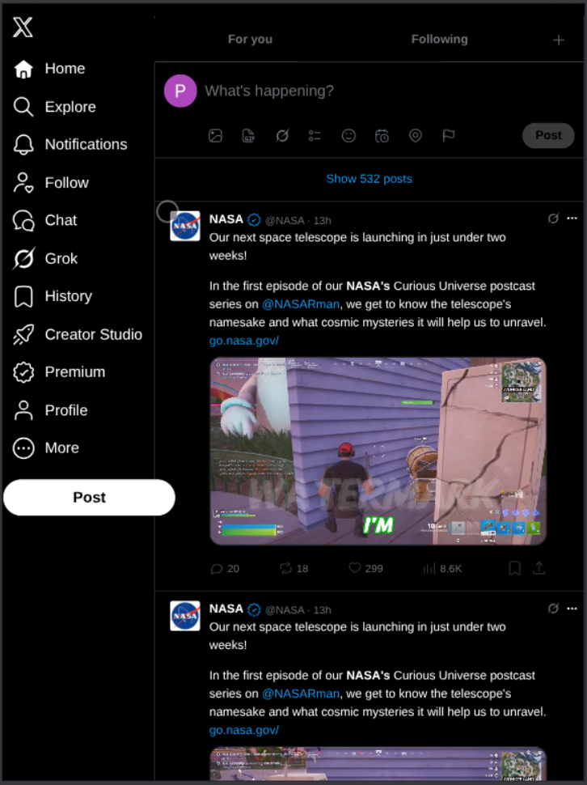
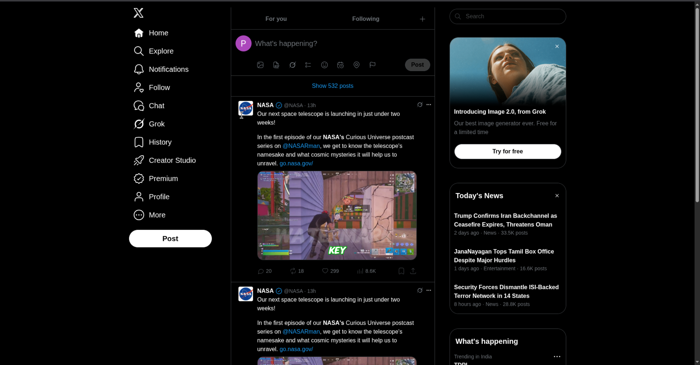

# X Clone

A responsive, dark-mode recreation of the X home timeline, built with semantic HTML and Tailwind CSS. The page includes the navigation sidebar, post composer, timeline feed, trends, news, and suggested accounts panels.

## Preview

### Phone view (IPONE 14PRO MAX)


### Tab view (IPAD MINI)


### Monitor view (DEFAULT)


## Tech stack

- HTML5
- Tailwind CSS
- Custom SVG icons and local image assets

## Getting started

### 1. Install dependencies

```bash
npm install
```

### 2. Build Tailwind CSS

```bash
npm run build
```

The build command watches `src/input.css` and writes the generated stylesheet to `src/output.css`.

### 3. Open the app

Serve the project directory with any static web server, then open the displayed local URL. For example:

```bash
python3 -m http.server 8000
```

Visit [http://localhost:8000](http://localhost:8000) in your browser.

## Project structure

```text
.
├── assets/       # Feed and profile images
├── preview/      # Project preview images
├── src/          # Tailwind input and generated CSS
├── svgs/         # UI icons
└── index.html    # Main page
```

## Disclaimer

This is an independent educational project and is not affiliated with or endorsed by X Corp.
